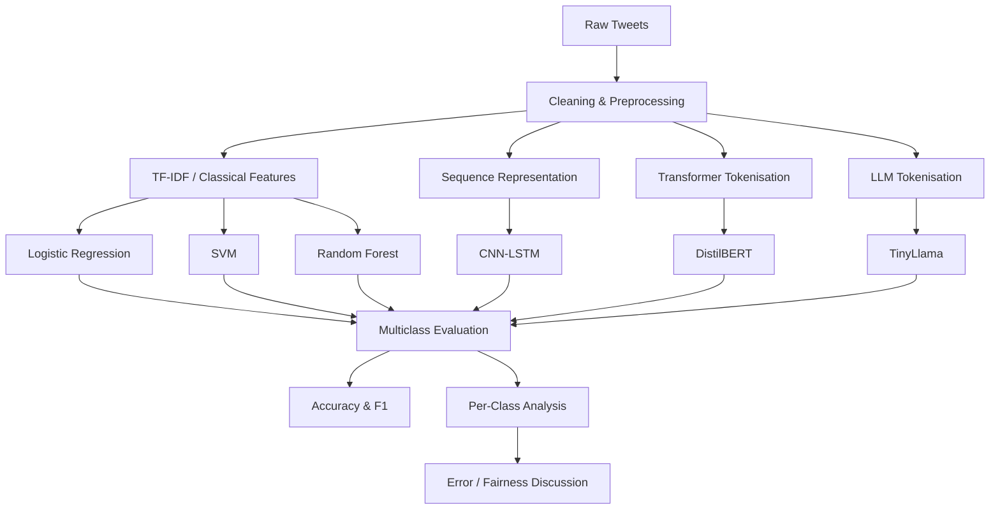

# Multiclass Cyberbullying Detection with Machine Learning and Transformer Models


> Comparative NLP research evaluating classical machine learning, deep learning, transformer and language-model approaches for multiclass cyberbullying detection.

## Publication Status

**Accepted for oral presentation and inclusion in the IEEE workshop proceedings at SMAP 2026 — the 21st International Workshop on Smart Media Adaptation, AI & Personalization.**

**Paper:** *Multiclass Cyberbullying Detection with Machine Learning and Transformer Models*

**Authors:** Oyinkepreye Nabena, Busiyi Fagbamigbe, Alaa Mohasseb, Andreas Kanavos

The final IEEE citation and DOI will be added when the proceedings metadata is available.

---

## Project Overview

Cyberbullying detection is not simply a binary abusive/not-abusive classification problem. Harmful language can target age, gender, ethnicity, religion and other characteristics, while some messages are ambiguous or difficult to distinguish from non-cyberbullying content.

This project investigates cyberbullying detection as a **six-class natural language processing task** and compares multiple modelling families:

- Logistic Regression
- Support Vector Machine
- Random Forest
- CNN-LSTM
- DistilBERT
- TinyLlama

The study examines both overall predictive performance and **class-level behaviour**, highlighting how aggregate scores can hide important differences between easy and difficult categories.

---

## Dataset

**Source:** Cyberbullying Tweets Dataset  
**Dataset size:** 95,392 tweets

### Classes

- Age
- Ethnicity
- Gender
- Religion
- Not Cyberbullying
- Other Cyberbullying

---

## Research Questions

The project explores:

1. How effectively can traditional machine learning models classify different forms of cyberbullying?
2. Does a hybrid CNN-LSTM architecture improve performance over classical baselines?
3. How does a fine-tuned transformer model compare with traditional and deep-learning approaches?
4. Can a compact language model such as TinyLlama generalise effectively across the full multiclass label space?
5. How much does performance vary between cyberbullying categories?

---

## Modelling Pipeline



---

## Models

### Classical Machine Learning
- Logistic Regression
- Support Vector Machine
- Random Forest

### Deep Learning
- CNN-LSTM

### Transformer
- DistilBERT

### Large Language Model
- TinyLlama

---

## Results

Approximate overall results from the completed experiments are summarised below.

| Model | Accuracy | Weighted F1 |
|---|---:|---:|
| Logistic Regression | ~0.80 | ~0.80 |
| SVM | ~0.81 | ~0.81 |
| Random Forest | ~0.81 | ~0.81 |
| CNN-LSTM | ~0.82 | ~0.82 |
| **DistilBERT** | **~0.87** | **~0.87** |
| TinyLlama | ~0.61 | ~0.61 |

**DistilBERT achieved the strongest overall performance.**

---

## DistilBERT Class-Level Performance

| Class | Approx. F1 |
|---|---:|
| Age | ~0.99 |
| Ethnicity | ~0.98 |
| Religion | ~0.97 |
| Gender | ~0.90 |
| Other Cyberbullying | ~0.73 |
| Not Cyberbullying | ~0.66 |

The strongest transformer model performed very differently across categories. Categories with clearer recurring linguistic signals were easier to classify, while **Not Cyberbullying** and **Other Cyberbullying** remained substantially harder.

---

## Key Findings

- **DistilBERT produced the strongest overall results**, outperforming the classical baselines and CNN-LSTM.
- **Aggregate metrics do not tell the full story**. Strong overall accuracy coexisted with substantially weaker performance on ambiguous classes.
- **Ambiguous categories remain the main challenge**, especially Not Cyberbullying and Other Cyberbullying.
- **TinyLlama generalised poorly across parts of the label space**, showing that an LLM does not automatically outperform a task-specific transformer.
- **Per-class evaluation is essential** for moderation-related NLP because overall metrics can conceal severe class-level failures.

---

## Fairness and Model Behaviour

The project includes class-level analysis because cyberbullying categories are not equally difficult to recognise.

The observed variation does **not** by itself establish demographic fairness or unfairness. Instead, it shows that the models have different error profiles across the dataset's bullying categories.

Important observations include:

- categories with strong lexical markers were easier to classify
- ambiguous categories produced significantly lower F1 scores
- TinyLlama failed to recover some classes effectively
- aggregate metrics alone can conceal severe class-level weaknesses

---

## Technology Stack

- Python
- Pandas
- NumPy
- scikit-learn
- TensorFlow / Keras
- Hugging Face Transformers
- DistilBERT
- TinyLlama
- Jupyter Notebook
- Matplotlib

---

## Repository Structure

```text
cyberbullying-detection-ml-dl-llm/
├── Cyberbullying_Detection.ipynb
├── cyberbullying_tweets.csv
└── README.md
```

`Cyberbullying_Detection.ipynb` contains the experimental workflow, model training and evaluation.

---

## Reproducing the Project

```bash
git clone https://github.com/Pnabena/cyberbullying-detection-ml-dl-llm.git
cd cyberbullying-detection-ml-dl-llm
jupyter notebook Cyberbullying_Detection.ipynb
```

> Transformer and language-model experiments may require GPU resources.

---

## Limitations

- The study evaluates a single benchmark dataset and should not be assumed to generalise unchanged to other platforms or communities.
- Cyberbullying language evolves over time.
- Dataset labels may not capture every contextual or culturally specific interpretation of harmful language.
- Strong aggregate metrics can hide weak performance on individual classes.
- The class-level analysis describes model behaviour on this dataset and should not be interpreted as a complete fairness audit.

---

## Future Work

Potential extensions include:

- multilingual cyberbullying detection
- culturally aware language modelling
- stronger explainability methods
- fairness-aware training and evaluation
- conversational/context-aware cyberbullying detection
- deployment-oriented moderation pipelines
- evaluation on newer and cross-platform datasets

---

## Publication

**Oyinkepreye Nabena, Busiyi Fagbamigbe, Alaa Mohasseb, Andreas Kanavos.**  
*Multiclass Cyberbullying Detection with Machine Learning and Transformer Models.*  
Accepted for oral presentation and inclusion in the IEEE workshop proceedings at **SMAP 2026, the 21st International Workshop on Smart Media Adaptation, AI & Personalization**.

**IEEE citation / DOI:** To be added when available.

---

## Author

**Preye Nabena**

Applied AI & Machine Learning Engineer  
MSc Artificial Intelligence & Machine Learning, University of Portsmouth  
BSc Statistics

- GitHub: https://github.com/Pnabena
- LinkedIn: https://linkedin.com/in/preye-nabena
- Portfolio: https://preye.vercel.app/
